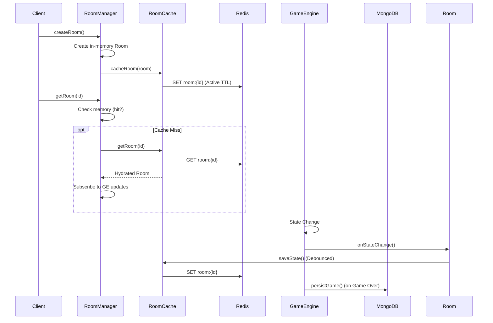

# Architecture Documentation - Phase 16

## Persistence & Caching Layers

### Data Flow Overview

### Components

| Component | Responsibility | Storage |
|-----------|---------------|---------|
| `RoomManager` | Orchestrates room lifecycle. Async API. | Memory + Redis |
| `RoomCache` | Abstraction for Redis caching. Handles serialization & TTLs. | Redis |
| `Redis` | Distributed cache for active room state. | RAM / Disk (RDB) |
| `MongoDB` | Authoritative persistence for completed games & user stats. | Disk |

### Caching Strategy

- **Role**: Redis acts as a distributed cache and potential pub/sub layer (future).
- **Write Strategy**: Write-through (debounced for frequent game updates).
- **Read Strategy**: Cache-aside / Hydrate on demand.
- **TTL Policies**:
    - `WAITING`: 1 hour (cleaned up if no start).
    - `PLAYING`: 24 hours (active games).
    - `FINISHED`: 5 minutes (grace period).
- **Resilience**:
    - Circuit breaker pattern prevents cascading failures.
    - Fallback: System logs errors but continues best-effort execution if Redis fails (fire-and-forget writes).

### Redis Configuration

- **Connection**: Managed via `redis.ts` singleton.
- **Circuit Breaker**: Auto-opens after 5 failures, resets after 30s.
- **TLS**: Auto-enabled for production (Upstash compatible).

### Health Monitoring

- `/health` endpoint checks Redis connectivity, memory usage, and key counts.
- `lastFailureTime` and `failureCount` tracked internally.
